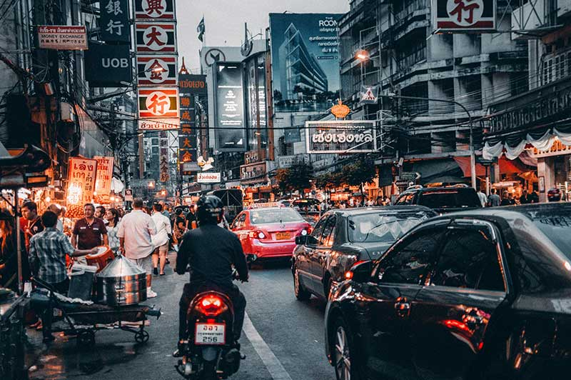
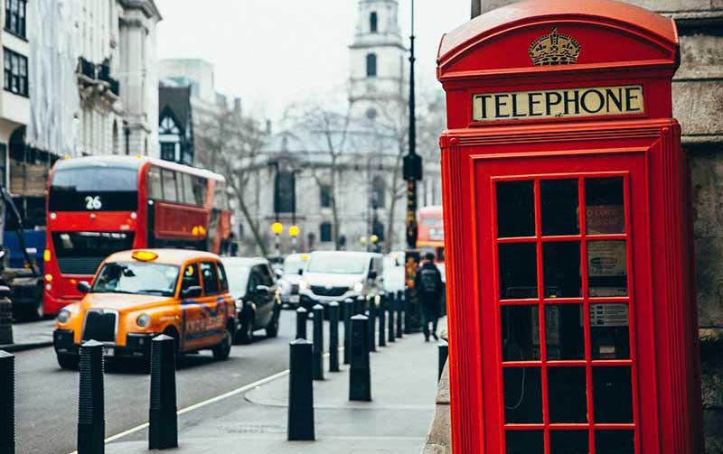
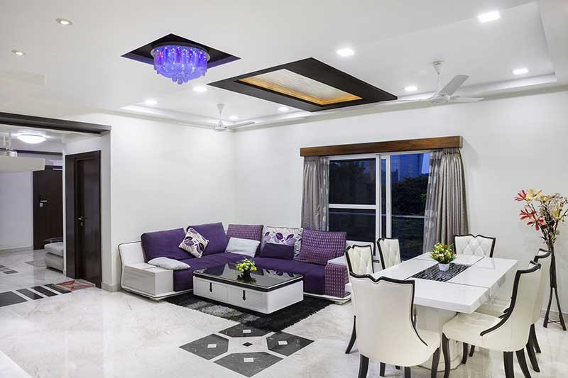
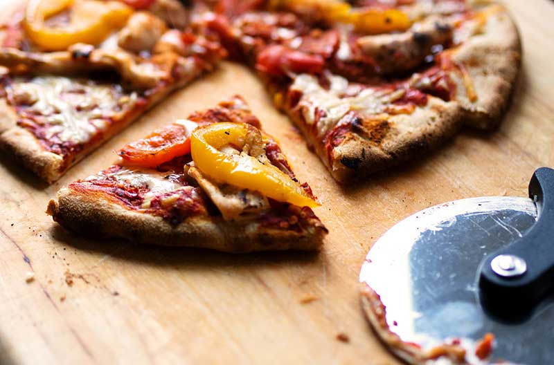
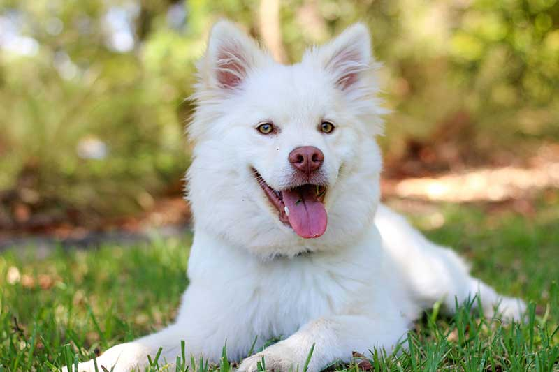
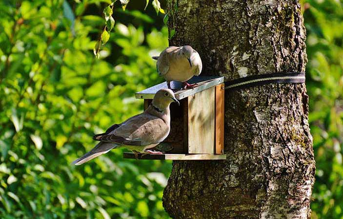

# alt

_Automatic alternative (alt) text for images using object detection with pre-trained model._

### Overview

A very simple PHP library to generate alternative (alt) text for images using pre-trained tensorflow model to detect objects in an image. These texts can provide context about image to visitors who are unable to see images in their browser for whatever reasons. Alt texts can also be picked up by screen readers to convert it to speech, thus, providing additional context to visually impaired people and enhanching our user experience.

### Installation

> Requires: PHP 7.1.3+, [OpenCV](https://opencv.org/), [PHP OpenCV](https://github.com/php-opencv/php-opencv)  
> Model used:  [SSDLite COCO v2](https://github.com/tensorflow/models/blob/master/research/object_detection/g3doc/detection_model_zoo.md)

Pull the package via composer.
```shell
$ composer require ankitpokhrel/alt
```

### Usage

```php
$alt = new \Alt\Alt('/path/to/image.ext');

echo $alt->alt(); // Image may contain: 6 person, cup, laptop

$alt->setImage('/path/to/image.ext')->alt(); // Image may contain: car, motorcycle
```

### Threshold

The classification threshold is set to `30` by default. You can adjust it as your need.

```php
$alt->setThreshold(25);
```

### Prefix

By default the alt is prefixed with `Image may contain: `. You can change this as below:

```php
$alt->setPrefix('Image has: ');
```

### Countable

If you want to display the count of an object, you can do so by setting `countable` array. `person` is countable by default.

```php
$alt->setImage('/path/to/image.ext')->alt(); // Image may contain: 5 person, dog, cup

// Adding dog as countable
$alt->setCountable(['person', 'dog'])->alt(); // Image may contain: 5 person, 2 dog, cup
```

### Default text

Default text is used if the model is not able to predict any objects within a given threshold. Default default text is `No photo description available.`.

```php
$alt->setDefaultText('Some scenary.');
```

### Examples
| | | | |
|-|-|-|-|
|  <br>_Image may contain: cup, potted, laptop_ |  <br>_Image may contain: 6 person, cup, laptop_ |  <br>_Image may contain: 5 person, car, motorcycle_ |  <br>_Image may contain: 1 person, car, bus, truck, traffic light_ |
|  <br>_Image may contain: chair, couch_ |  <br>_Image may contain: pizza, dining table_ |  <br>_Image may contain: dog_ |  <br>_Image may contain: bird_ |
